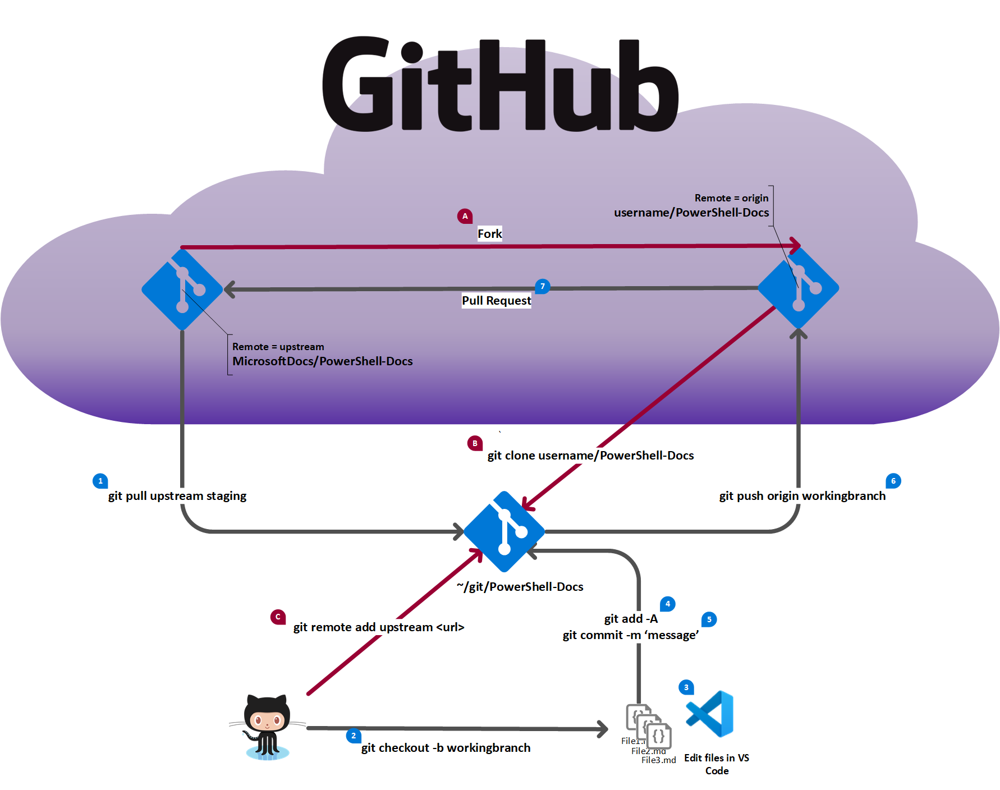

# Documenting in VSCode
## Presenter: Sean Wheeler
### Date: 6 Jan 2021
### Email: Sean.Wheeler@microsoft.com
### LinkedIn: https://www.linkedin.com/in/scriptingsean/
### Twitter: [@swsamwa](https://twitter.com/swsamwa)
### GitHub: [@sdwheeler](https://github.com/sdwheeler)
### Website: https://seanonit.wordpress.com/
### Summary

Sean Wheeler, from Microsoft, will demo what tools he uses to create documentation for
docs.microsoft.com. He will show us how he uses those tools and tips to being more effective when
writing your markdown.

#### Notes

There are no slides for this presentation. The presentation is focused on demos.

- Who am I and how did I get started?

  I am the Lead writer for PowerShell documentation at Microsoft. I have worked at Microsoft for 22
  years. Most of that time was spent in Product Support for Windows. Lots of experience with
  scripting, network protocol analysis, crash dump analysis, and teaching classes for all of those
  topics.

   For how I got started, see https://seanonit.wordpress.com/about.

- Quick overview of "How to contribute to PowerShell-Docs":

  - Read the [PowerShell-Docs Contributor Guide](https://aka.ms/PSDocsContributor)
  - GitHub repository for [PowerShel-Docs](https://github.com/MicrosoftDocs/PowerShell-Docs)
  - See [What's new in Docs](https://aka.ms/WhatsNewInPSDocs)

- The tools you need

  - Git and a GitHub account (see https://docs.microsoft.com/contribute/get-started-setup-tools)
  - Install and configure posh-git (see https://seanonit.wordpress.com/2016/12/05/using-git-from-powershell/)
    - My blog article is a bit outdated now. Read the README for posh-git for latest install instructions.
  - Visual Studio Code (see https://code.visualstudio.com)
  - Microsoft Docs Authoring Pack (see https://docs.microsoft.com/contribute/how-to-write-docs-auth-pack)

- Quick overview of GitHub workflow

  

  **One-time steps to setup repo (red arrows above)**

  A. Go to https://github.com/MicrosoftDocs/Powershell-Docs. Click the **Fork** button (top right
    of page). Add the fork to your personal account.

  B. Clone your fork to your local machine. This automatically creates the remote named `origin`.

  C. Add the `upstream` remote pointing to the MicrosoftDocs copy of the repo.

  **Contribution workflow (black arrows above)**

  1. Pull the `staging` (default) branch from upstream to you local clone to ensure you have the
    latest content.
  1. Create a new working branch.
  1. Edit the content you want to create or update.
  1. Add your changes to git tracking.
  1. Commit the tracked changes to your working branch.
  1. Push your working branch to your forke (`origin`).
  1. Create a pull request to merge the working branch from your fork to the `staging` branch in
    Microsoftdocs.

- The VS Code features and extensions I use
  - VS Code features
    - Git integration
    - Outline view
    - Rulers
    - Problems pane
    - Settings
    - Collapsing blocks (code, text, lists, etc.)
  - VS Code extensions
    - Acrolinx.vscode-sidebar (Microsoft Only)
    - docsmsft.docs-authoring-pack
      - DavidAnson.vscode-markdownlint
      - streetsidesoftware.code-spell-checker
    - Markdown helpers
      - marvhen.reflow-markdown
      - shuworks.vscode-table-formatter
      - Tyriar.sort-lines
      - wmaurer.change-case
      - yzane.markdown-pdf
    - Words, lines, and characters
      - DrMattSm.replace-smart-characters
      - nhoizey.gremlins
      - ms-vscode.wordcount
      - medo64.code-point
      - tomoki1207.selectline-statusbar
    - Code helpers
      - CoenraadS.bracket-pair-colorizer
    - Excel helpers
      - csholmq.excel-to-markdown-table
      - GrapeCity.gc-excelviewer
    - JSON helpers
      - nickdemayo.vscode-json-editor
      - richie5um2.vscode-sort-json
    - Content preview
      - cssho.vscode-svgviewer
      - slevesque.vscode-hexdump

&nbsp;
&nbsp;

[All Repos](https://github.com/sdwheeler?tab=repositories)
